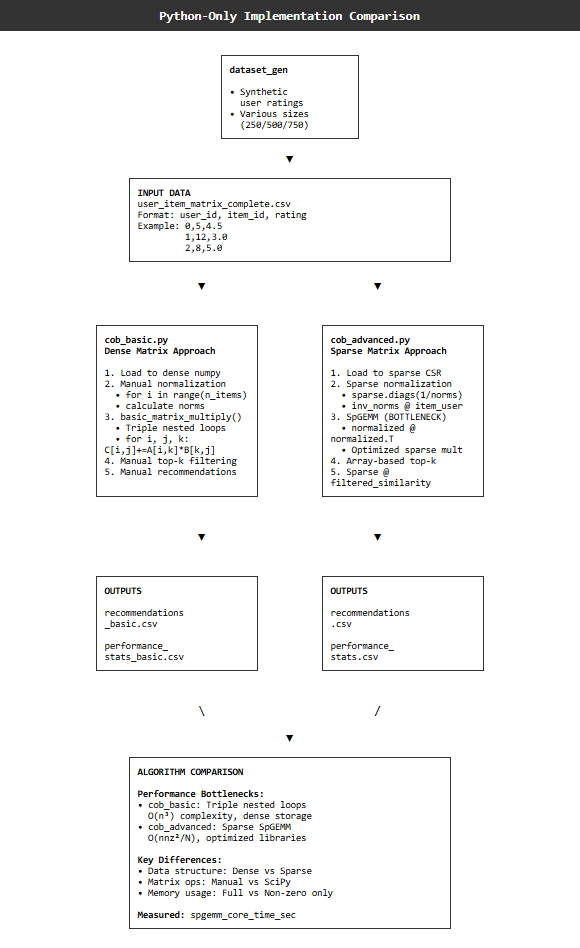

# Python Implementation Approaches

###  `cob_basic.py` - Baseline Implementation

**Purpose:** Establishes performance baseline using naive matrix operations

**Key Features:**
- **Dense Matrix Storage**: Loads entire user-item matrix into memory as numpy arrays
- **Manual Matrix Multiplication**: Implements `basic_matrix_multiply()` using triple nested for-loops
- **Educational Baseline**: Demonstrates O(n³) complexity without optimizations
- **Memory Intensive**: Stores all matrix elements, including zeros

**Algorithm Flow:**
```
1. Load CSV → Dense numpy array
2. Manual normalization with for-loops  
3. Triple nested loops: for i,j,k: C[i,j] += A[i,k] * B[k,j]
4. Manual top-k filtering
5. Generate recommendations via basic matrix operations
```

### `cob_advanced.py` - Production Implementation

**Purpose**: Production-ready collaborative filtering using optimized sparse matrix operations

**Key Features:**

- Sparse CSR Format: Memory-efficient storage using SciPy sparse matrices
- Optimized SpGEMM: Leverages highly-tuned sparse matrix multiplication
- Bottleneck Identification: Tracks spgemm_core_time_sec for hardware acceleration targeting
- Memory Efficient: Only stores non-zero entries

**Algorithm Flow:**
```
1. Load CSV → sparse.csr_matrix()
2. Sparse normalization: sparse.diags(1/norms) @ item_user  
3. SpGEMM bottleneck: normalized_item_user @ normalized_item_user.T
4. Vectorized top-k filtering with numpy.partition()
5. Final recommendations: user_item_matrix @ filtered_similarity
```



# How to Run Python Implementations

This guide explains how to run both `cob_basic.py` and `cob_advanced.py` implementations of the collaborative filtering algorithm.

## Prerequisites

Install required Python packages:

```bash
pip install numpy pandas scipy
```
## Project Structure Overview

```
01_python_software_only/
├── COB_base/                       # Baseline implementation (dense matrix + for-loops)
├── COB_advanced/                   # Optimized implementation (sparse matrix + SciPy)
└── COB_coprocessor_benchmarking_only/  # Hardware acceleration non pipeline
```

## Dataset Preparation

### Step 1: Select Your Dataset

Navigate to the `datasets/` folder and choose your test matrix size:

```
datasets/
├── 250/
│   └── user_item_matrix_complete.csv    # 250×250 matrix (~3K ratings)
├── 500/
│   └── user_item_matrix_complete.csv    # 500×500 matrix (~12K ratings)
└── 750/
    └── user_item_matrix_complete.csv    # 750×750 matrix (~28K ratings)
```

### Step 2: Copy Dataset to Implementation Folders

For `cob_basic.py`:
```bash
cp COB_base/datasets/250/user_item_matrix_complete.csv cob_basic/
```

For `cob_advanced.py`:
```bash
cp COB_advanced/datasets/250/user_item_matrix_complete.csv cob_advanced/
```

> **Note:** Start with the 250×250 dataset for initial testing. The `cob_basic.py` implementation may be very slow on larger datasets.

## Running the Basic Implementation

### Execute cob_basic.py

```bash
cd cob_basic/
python cob_basic.py
```

### Generated Files

- `recommendations.csv` - Top-5 recommendations per user
- `performance_stats_basic.csv` - Detailed timing breakdown

## Running the Advanced Implementation

### Execute cob_advanced.py

```bash
cd cob_advanced/
python cob_advanced.py
```

### Generated Files

- `recommendations.csv` - Top-5 recommendations per user (identical to basic)
- `performance_stats.csv` - Timing with SpGEMM bottleneck identified

## Verifying Results

### Compare Recommendations (Should be Identical)

## Output File Formats

### recommendations.csv 
```csv
user_id,item_id,predicted_rating
0,15,4.21
0,23,3.87
0,8,3.65
1,7,4.45
1,12,4.02
```

### performance_stats.csv / performance_stats_basic.csv
```csv
data_load_time_sec,collaborative_filtering_time_sec,spgemm_core_time_sec,total_execution_time_sec,n_users,n_items
0.02,2.12,1.89,2.14,250,250
```

## Key Performance Insight

The `performance_stats.csv` from `cob_advanced.py` identifies the **SpGEMM bottleneck**:
- `spgemm_core_time_sec: 1.89s` out of `total_execution_time_sec: 2.14s`
- This represents **88% of execution time** spent in sparse matrix multiplication
- This bottleneck becomes the **primary target** for MatRaptor hardware acceleration

## Troubleshooting

### Memory Issues
- **Problem:** `cob_basic.py` runs out of memory on large datasets
- **Solution:** Use smaller datasets (250×250) or switch to `cob_advanced.py`

### File Not Found
- **Problem:** `FileNotFoundError: user_item_matrix_complete.csv`
- **Solution:** Ensure CSV file is copied to the same directory as the Python script

### Slow Performance
- **Problem:** `cob_basic.py` takes very long time
- **Solution:** This is expected! Start with 250×250 dataset. For 500×500 and larger, use `cob_advanced.py`

### Import Errors
- **Problem:** `ModuleNotFoundError: No module named 'scipy'`
- **Solution:** Install dependencies: `pip install numpy pandas scipy`

## Performance Benchmarks

For complete experimental details, statistical analysis, and comprehensive benchmarking across multiple datasets, see [Detailed Performance Analysis](https://github.com/AbhishekMusku/hw4aiml-am/wiki/Project-%E2%80%90-SpGEMM-Accelerator#baseline-implementation--benchmarking)

