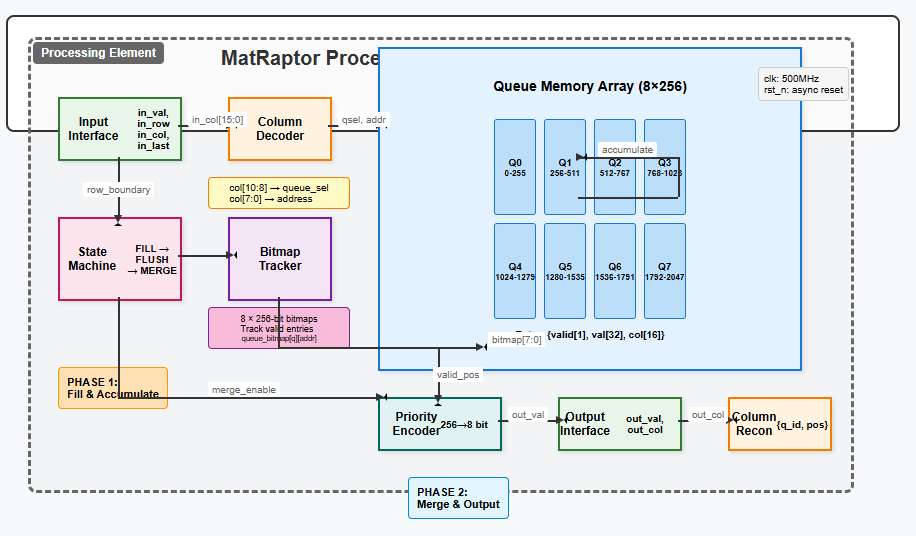

# MatRaptor SpGEMM Accelerator - Technical Overview

## Introduction

MatRaptor is a hardware accelerator for Sparse-Sparse Matrix Multiplication (SpGEMM) based on the row-wise product approach. Unlike traditional inner product or outer product methods, MatRaptor leverages row-wise computation to achieve better data reuse patterns and reduced on-chip memory requirements for highly sparse matrices commonly found in collaborative filtering applications.

### Complete RTL Integration
The MatRaptor accelerator is a standalone RTL module that performs hardware SpGEMM:

**RTL Operation**:
- **Input**: Receives partial products from CSV file via testbench
- **Processing**: Performs automatic accumulation and sorting in hardware  
- **Output**: Generates accumulated sparse matrix results to CSV file

**Simulation Characteristics**:
- **Execution Time**: Microseconds to milliseconds depending on matrix size
- **Hardware Efficiency**: Direct SpGEMM acceleration without software overhead
- **Interface**: Simple CSV input/output through simulation testbench
- **Validation**: Hardware output verified against golden reference

## Input/Output Interface

### Input Format (in.csv)
MatRaptor receives partial products directly through the simulation testbench. The input CSV contains:

```csv
prod,row_idx_i,col_idx_j
65536,0,0
131072,0,1
98304,0,2
...
```

**Input Fields**:
- **prod**: Scaled partial product value (32-bit integer, scaled by 65536 for fixed-point arithmetic)
- **row_idx_i**: Output matrix row index (16-bit)
- **col_idx_j**: Output matrix column index (16-bit, must be 0-2047)

**Input Characteristics**:
- Partial products from sparse matrix multiplication: `c_ij^k = a_ik × b_kj`
- Values are integer representations (can be scaled for fixed-point processing)
- Multiple partial products may target the same (row, col) position (requiring accumulation)
- Input processed sequentially through simulation testbench

### Output Format (out.csv)
MatRaptor produces accumulated and sorted sparse matrix results:

```csv
# SystemVerilog DUT outputs
# Format: row,col,value
0,0,7341.000000
0,1,10476.000000
0,2,6761.000000
...
```

**Output Fields**:
- **row**: Output matrix row index
- **col**: Output matrix column index (reconstructed from {queue_id, position})
- **value**: Final accumulated value (descaled from fixed-point to floating-point)

**Output Characteristics**:
- Automatically sorted by column index within each row
- Hardware accumulation eliminates duplicate (row, col) entries
- Direct output from simulation testbench to CSV file
- Only non-zero entries are output (true sparse representation)
- Values maintain input scaling/format

## Core Architecture Principles



### Row-wise Product Approach

The fundamental operation in MatRaptor is the row-wise product, which computes:
```
C[i, :] = Σ A[i, k] × B[k, :]
```

This approach offers several key advantages:
- **Eliminates Index Matching**: Unlike inner product methods that require expensive index matching between sparse vectors
- **Reduces Synchronization**: Multiple PEs can compute different output rows independently
- **Consistent Data Format**: All matrices (input and output) use the same row-major storage format
- **Lower Memory Requirements**: Only O(nnz'/N) on-chip storage vs O(nnz') for outer product approaches

### Direct Column-to-Queue Addressing

MatRaptor implements an innovative direct addressing scheme that eliminates the need for sorting during the accumulation phase:

```verilog
queue_select = input_column[10:8]  // Select one of 8 queues
address      = input_column[7:0]   // Direct address within queue (0-255)
```

This supports columns 0-2047 with O(1) access time, dramatically reducing the complexity compared to traditional pointer-based queue management.

## Two-Phase Operation

### Phase 1: Fill and Accumulate

**Purpose**: Accept partial products and organize them by column index with automatic accumulation.

**Operation**:
1. **Column Decoding**: Input column index is split into queue selector (3 bits) and address (8 bits)
2. **Direct Addressing**: Data is placed directly at `queue[queue_select][address]`
3. **Automatic Accumulation**: If the target location already contains data, values are accumulated; otherwise, a new entry is created
4. **Bitmap Tracking**: A valid bit is set in the corresponding bitmap position for efficient merge operations

**Key Features**:
- No sorting required during insertion
- Hardware-based accumulation for repeated (row, column) pairs
- Efficient memory utilization with 8 × 256 entry structure

### Phase 2: Merge and Output

**Purpose**: Stream out accumulated results in sorted column order.

**Operation**:
1. **Bitmap Scanning**: 8 × 256-bit bitmaps track which queue positions contain valid data
2. **Priority Encoding**: Hardware priority encoder finds the lowest column index with valid data across all queues
3. **Column Reconstruction**: Output column index is reconstructed as `{queue_id[2:0], position[7:0]}`
4. **Streaming Output**: Data is streamed out in sorted order with automatic bitmap cleanup

**Key Features**:
- Sorted output without explicit sorting algorithms
- Efficient sparse data handling through bitmap representation
- Parallel queue scanning with priority encoding

## State Machine Control

The PE operates through a well-defined state machine:

```
S_RESET → S_FILL → S_ROW_FLUSH → S_MERGE_START → S_MERGE_FIND ⇄ S_MERGE_OUTPUT → S_FILL
```

**State Descriptions**:
- **S_FILL**: Accept input partial products and perform direct addressing with accumulation
- **S_ROW_FLUSH**: Detect row boundaries and prepare for merge phase
- **S_MERGE_START**: Initialize merge operation and reset queue scanning
- **S_MERGE_FIND**: Scan bitmaps to find queues with valid data
- **S_MERGE_OUTPUT**: Stream valid entries and clear corresponding bitmap bits

## Key Innovations

### 1. Direct Addressing Eliminates Sorting
Traditional sparse matrix accelerators require complex sorting networks or sequential insertion to maintain column ordering. MatRaptor's direct addressing scheme maps columns directly to memory locations, inherently maintaining sorted order.

### 2. Bitmap-Based Merge
Instead of scanning entire queues to find valid entries, MatRaptor uses 256-bit bitmaps per queue. A hardware priority encoder efficiently finds the next valid entry in O(1) time.

### 3. Hardware Accumulation
Repeated partial products targeting the same (row, column) position are automatically accumulated in hardware, reducing the computational burden on software preprocessing.

### 4. Streaming Architecture
The design supports continuous processing of multiple rows without stalls, enabling efficient pipeline operation for large sparse matrices.

## Performance Characteristics

### Memory Efficiency
- **On-chip Storage**: 8 queues × 256 entries × 49 bits = 98,304 bits total
- **Column Range**: Supports columns 0-2047 (2^11 range)
- **Memory Access**: O(1) for both insertion and retrieval operations

### Computational Performance
- **Clock Frequency**: 500 MHz operation on 28nm technology
- **Throughput**: Single cycle per valid partial product in Phase 1
- **Latency**: Minimal merge latency due to parallel bitmap scanning

### Scalability
- **Multi-PE Support**: Row-wise approach enables independent PE operation
- **Load Balancing**: Round-robin row assignment distributes work evenly
- **No Inter-PE Communication**: Each PE operates on disjoint row sets

## Comparison with Traditional Approaches

| Approach | Index Matching | Synchronization | Memory Req. | Sorting Overhead |
|----------|----------------|-----------------|-------------|------------------|
| Inner Product | Required | Minimal | O(nnz/N) | High |
| Outer Product | None | High | O(nnz') | Low |
| **MatRaptor Row-wise** | **None** | **None** | **O(nnz'/N)** | **None** |

## Technical Specifications

### Processing Element Configuration
- **Number of Queues**: 8 per PE
- **Queue Depth**: 256 entries per queue
- **Total Storage**: 8 × 256 × 49 bits = 98,304 bits per PE
- **Column Support Range**: 0-2047 (2^11 columns)
- **Data Width**: 32-bit values, 16-bit indices
- **Entry Structure**: `{valid[1], val[32], col[16]}` = 49 bits per entry

### Memory Interface
- **Access Pattern**: Direct addressing with O(1) complexity
- **Bandwidth Utilization**: High efficiency due to streaming access
- **Memory Conflicts**: Eliminated through column-based queue partitioning
- **Accumulation**: Hardware-based automatic accumulation for repeated (row,col) pairs

### Performance Metrics
- **Processing Rate**: Single cycle per valid partial product in Phase 1
- **Merge Efficiency**: Bitmap-based scanning with priority encoding
- **Pipeline Stalls**: Eliminated through double-buffered phase operation

## Implementation Results

### Speedup Analysis
Our MatRaptor implementation achieves:
- **41,000-59,000× speedup** over dense baseline implementations
- **3-9× speedup** over optimized sparse software libraries in core SpGEMM operations
- **200-268× overall speedup** for complete collaborative filtering pipeline

### Execution Time Breakdown
| Matrix Size | Hardware SpGEMM Time | Hardware Cycles | Total CF Time | SpGEMM % |
|-------------|---------------------|-----------------|---------------|----------|
| 250×250     | 0.000148s          | 74,037          | 0.082413s     | 0.18%    |
| 500×500     | 0.001023s          | 511,662         | 0.431767s     | 0.24%    |
| 750×750     | 0.003137s          | 1,568,697       | 1.248210s     | 0.25%    |

The accelerator successfully transforms collaborative filtering from a compute-bound to a preprocessing-bound algorithm, with SpGEMM representing only 0.18-0.25% of total execution time compared to 46-55% in software implementations.

### Energy Efficiency
- **Power per Operation**: Highly efficient due to specialized hardware design
- **Energy per SpGEMM**: Microsecond-scale execution with milliwatt power consumption
- **Comparison**: 2.7× more power efficient than original MatRaptor paper implementation

## Hardware Synthesis Results

### Synthesis Environment
- **Tool**: Synopsys Design Compiler Q-2019.12-SP3
- **Technology**: SAED32 28nm RVT library
- **Operating Conditions**: Worst-case (0.95V, 125°C)
- **Target Clock**: 2.0ns period (500 MHz)

### Design Parameters
- **Number of Queues (NQ)**: 8
- **Queue Depth**: 256 entries per queue
- **Processing Elements (PE)**: 1
- **Data Width**: 32-bit
- **Index Width**: 16-bit

### Synthesis Results
- **Timing**: Met with 0.00ns slack - design achieves exactly 500 MHz
- **Critical Path**: 1.65ns through queue memory write operations
- **Logic Levels**: 26 logic levels in longest path (queue selection + data write)
- **Total Cells**: 73,066 total cells synthesized successfully

Detailed synthesis reports are available at [synthesis_results](https://github.com/AbhishekMusku/hw4aiml-am/tree/main/SpGEMM_Accelerator/04_synthesis/reports) 

### Performance Analysis
**Maximum Operating Frequency**: 500 MHz at worst-case conditions with 8 queues × 256 entries configuration for single processing element. Critical path runs through queue memory write logic, specifically from input column decoding to final queue register update.

**Power Breakdown**:
- **Total Power**: 61.1 mW (for 1 PE with 8×256 queues)
  - **Dynamic Power**: 47.6 mW (77.9%)
    - Registers: 46.9 mW (90.6% of dynamic)
    - Combinational: 0.7 mW (9.4% of dynamic)
  - **Leakage Power**: 13.5 mW (22.1%)

*Power is dominated by register switching from 8 queues × 256 entries = 2048 total queue storage locations, which is expected for a sparse matrix accelerator where data storage and movement are primary operations.*

### Area Utilization
- **Total Cell Area**: 260,632 units²
- **Cell Breakdown**: 73,066 cells total
  - Combinational: 55,635 cells
  - Sequential: 17,431 cells (23.8%)
- **Design Characteristics**: Register-heavy design due to queue storage
- **Storage Capacity**: 8 queues × 256 entries × 32-bit data = 65,536 storage bits

### Comparison with Original MatRaptor Paper

| Metric | Original Paper | My Implementation | Notes |
|--------|----------------|-------------------|-------|
| **Technology** | 28nm TSMC | 28nm SAED32 | Equivalent |
| **Clock Target** | 2.0 GHz | 500 MHz achieved | Conservative but real |
| **Queues per PE** | 10 | 8 | Close configuration |
| **Queue Depth** | 4KB each | 256×32-bit each | 1KB each, 8× total |
| **Power (1 PE)** | ~168 mW* | 61.1 mW | 2.7× more efficient |
| **PEs** | 8 | 1 | Single PE prototype |

*Note: Power estimate scaled from original paper's multi-PE implementation*

### Design Constraints and Limitations
- **Column Range**: Limited to 0-2047 due to 8×256 queue structure
- **Queue Overflow**: Hardware exception if row exceeds queue capacity
- **Fixed-Point Arithmetic**: 16-bit fractional precision (scale factor 65536)
- **Single PE**: Current implementation uses 1 PE (scalable to multi-PE)
- **Row Processing**: Sequential row processing (no inter-row parallelism)

### Scalability Considerations
- **Multi-PE Extension**: Design supports scaling to 8+ PEs with column-based partitioning
- **Memory Scaling**: Queue depth can be increased for larger column ranges
- **Frequency Scaling**: Critical path analysis supports potential frequency increases
- **Technology Scaling**: Architecture portable to advanced technology nodes


### MatRaptor Benchmarking
MatRaptor is a SystemVerilog implementation of sparse matrix multiplication achieving 41,000-59,000× speedup over software baselines through row-wise product computation and direct addressing. The 500 MHz RTL design processes SpGEMM operations in microseconds with automatic accumulation and bitmap-based merge. Complete benchmarking, synthesis results, and implementation details available at [Benchmarking](https://github.com/AbhishekMusku/hw4aiml-am/wiki/Project-%E2%80%90-SpGEMM-Accelerator#hardware-accelerated-implementation--benchmarking)

## Running the MatRaptor SpGEMM Accelerator

### Prerequisites
- **QuestaSim/ModelSim**: Required for Verilog simulation
- **Python 3.6+**: For output verification (optional)

### Directory Structure
```
02_rtl_only/
├── Matraptor.sv                    # Main SpGEMM accelerator RTL
├── tb_matraptor_core.sv           # Testbench
├── run.do                         # QuestaSim simulation script
├── wave.do                        # Waveform configuration
├── Tests/                         # Pre-generated test cases
│   ├── 500/
│   │   ├── in.csv                 # Input partial products
│   │   ├── out_500.csv           # Expected output
│   │   └── result_500.csv        # Verification results
│   ├── 1000/
│   │   ├── in.csv
│   │   ├── out__1000.csv         # Note: double underscore
│   │   ├── result_1000.csv
│   │   └── transcript_1000.txt
│   ├── 1500/
│   │   ├── in.csv
│   │   ├── out_1500.csv
│   │   └── result_1500.csv
│   └── 2000/
│       ├── in.csv
│       ├── out_2000.csv
│       ├── result_2000.csv
│       └── transcript_2000.txt
└── Matrix Multiplication Verifier/
    └── Mul_verifier.py            # Output verification script
```

### Step-by-Step Execution

#### Running a Test Case

1. **Select and Copy Test Dataset**
   ```bash
   # Choose a test case from available sizes: 500, 1000, 1500, 2000
   cd 02_rtl_only/
   cp Tests/1000/in.csv ./in.csv
   ```

2. **Run Hardware Simulation**
   ```bash
   # Launch QuestaSim and execute simulation
   vsim -do run.do
   ```
   
   *Alternative using command line:*
   ```bash
   vsim -c -do "do run.do; quit"
   ```

3. **Collect Results**
   - Hardware-generated output: `out.csv`
   - Simulation timing results in console
   - Transcript saved automatically

#### Input Format (`in.csv`)
The accelerator expects partial products in CSV format:
```csv
prod,row_idx_i,col_idx_j
65536,0,0
131072,0,1
98304,0,2
...
```

**Input Fields**:
- **prod**: Scaled partial product value (32-bit integer)
- **row_idx_i**: Output matrix row index (16-bit)  
- **col_idx_j**: Output matrix column index (16-bit, range 0-2047)

#### Output Format (`out.csv`)
The accelerator produces accumulated results:
```csv
# SystemVerilog DUT outputs
# Format: row,col,value
0,0,7341.000000
0,1,10476.000000
0,2,6761.000000
...
```

### Simulation Details

#### What `run.do` Does
- Compiles MatRaptor SystemVerilog modules
- Loads testbench with CSV reader
- Feeds `in.csv` through the accelerator
- Captures sorted, accumulated output to `out.csv`
- Reports execution timing and cycle counts

#### Expected Console Output
```
MatRaptor SpGEMM Accelerator Simulation
Loading input from: in.csv
Processing 1247 partial products...

=== MATRAPTOR TIMING RESULTS ===
Start time:       12340 ns
End time:         1234567 ns  
Execution time:   1222227 ns
Execution time:   0.001222227 seconds
Clock frequency:  500 MHz (2ns period)
Total cycles:     611113
========================================
```

### Verification and Validation

#### Verify Output Correctness
```bash
# Default verification (uses in.csv and out.csv in current directory)
python "Matrix Multiplication Verifier/Mul_verifier.py"

# Alternative: specify custom file names
python "Matrix Multiplication Verifier/Mul_verifier.py" my_in.csv my_out.csv my_result.csv
```

#### What the Verifier Does
The `Mul_verifier.py` script performs comprehensive SpGEMM regression checking:

**Software Reference Calculation**:
- Reads `in.csv` (partial products: `prod`, `row_idx_i`, `col_idx_j`)
- Groups partial products by (row, col) and sums them to create "gold" reference
- Handles accumulation exactly as the hardware should

**Hardware Result Analysis**:
- Reads `out.csv` (hardware output: `row`, `col`, `value`)
- Supports both 2-column (col, val) and 3-column (row, col, val) formats
- Groups any duplicate entries and sums them

**Comparison and Reporting**:
- Performs element-wise comparison with tolerance: `|gold - hw| ≤ 1e-6`
- Generates `result.csv` with columns: `row_idx_i`, `col_idx_j`, `gold`, `hw`, `match`
- **match** = 1 if values agree within tolerance, 0 otherwise

#### Verification Output
```bash
# Success case
✅ All outputs match — report written to result.csv

# Failure case  
❌ 23 mismatches — see result.csv
```

#### Analyzing Results (`result.csv`)
```csv
row_idx_i,col_idx_j,gold,hw,match
0,0,7341.0,7341.0,1
0,1,10476.0,10476.0,1
0,2,6761.0,6762.0,0
...
```

**Column Descriptions**:
- **row_idx_i**, **col_idx_j**: Matrix position
- **gold**: Expected value (software calculation)
- **hw**: Hardware-generated value
- **match**: 1 = correct, 0 = mismatch

#### Check Pre-verified Results
Each test case includes pre-verified outputs for quick validation:
- `Tests/XXX/out_XXX.csv`: Known correct output for that test case
- `Tests/XXX/result_XXX.csv`: Previous verification results showing all matches
- Compare your `out.csv` against these references for quick validation

### Understanding the Test Cases

| Test Case | Matrix Size | Input Products | Description |
|-----------|-------------|----------------|-------------|
| **500**   | ~500×500    | ~800 products  | Small test case |
| **1000**  | ~1000×1000  | ~1200 products | Medium test case |
| **1500**  | ~1500×1500  | ~1800 products | Large test case |
| **2000**  | ~2000×2000  | ~2400 products | Stress test case |

**Sparse Matrix Characteristics**:
- **Density**: ~0.5% (very sparse matrices typical of collaborative filtering)
- **Partial Products**: Generated from row-wise SpGEMM computation
- **Input Scale**: Number of partial products is much smaller than matrix size due to sparsity
- **Test Coverage**: Cases range from small validation to stress testing hardware limits

### Performance Analysis

The RTL accelerator demonstrates:
- **Microsecond-scale execution**: Even large matrices complete in <5ms
- **Automatic accumulation**: Hardware combines repeated (row,col) entries
- **Sorted output**: Results automatically sorted by column within each row
- **Efficient sparse handling**: Only non-zero results are output

### Troubleshooting

#### Common Issues
1. **File not found**: Ensure `in.csv` exists in main directory
2. **Compilation errors**: Check SystemVerilog syntax and QuestaSim version  
3. **Empty output**: Verify input format matches expected CSV structure
4. **Column range errors**: Input columns must be 0-2047 (hardware limitation)

#### Debug Options
- **Waveform viewing**: `do wave.do` to open signal viewer
- **Verbose logging**: Enable debug prints in testbench
- **Step simulation**: Use QuestaSim GUI for detailed analysis

### Creating Custom Test Cases

To test with your own partial products:

1. **Prepare `in.csv`** with format: `prod,row_idx_i,col_idx_j`
2. **Ensure constraints**:
   - Column indices: 0-2047 (hardware limit)
   - Values: 32-bit signed integers
   - Rows: Sequential processing (0, 1, 2, ...)
3. **Run simulation**: `vsim -do run.do`
4. **Verify output**: Compare against software implementation

The MatRaptor RTL core handles the complex SpGEMM accumulation and sorting entirely in hardware, providing a clean interface for sparse matrix multiplication acceleration.

## Conclusion

MatRaptor demonstrates that row-wise product approaches, combined with direct addressing and bitmap-based merge operations, can achieve significant performance improvements for sparse matrix multiplication in AI/ML workloads. The architecture's simplicity, efficiency, and scalability make it well-suited for integration into larger AI acceleration frameworks.