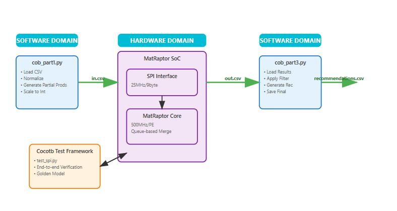
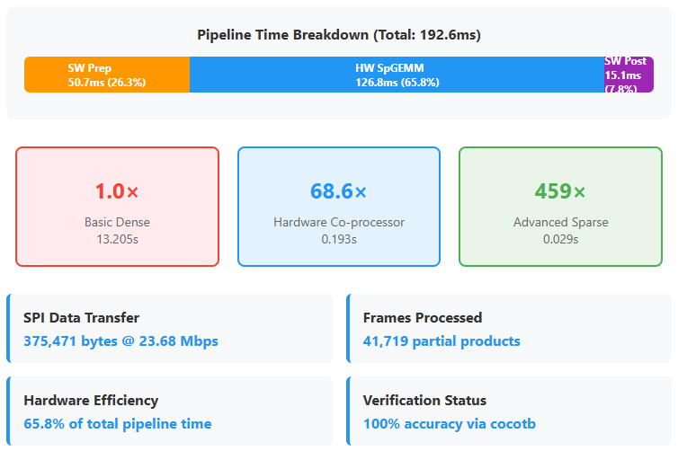
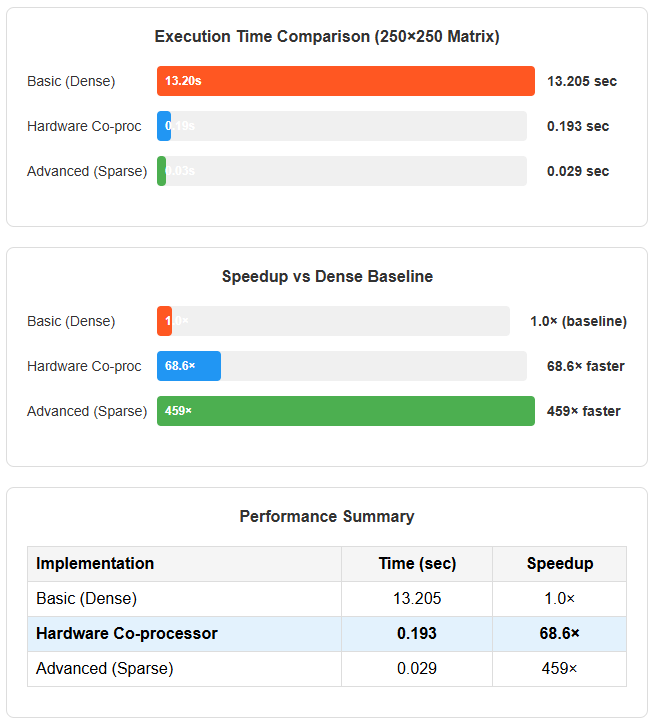

# MatRaptor Collaborative Filtering Coprocessor

## System Overview

### Structure, Inputs & Outputs

The **MatRaptor Collaborative Filtering Coprocessor** is a specialized hardware accelerator designed to perform sparse-sparse matrix multiplication for item-based collaborative filtering applications. The system implements a complete pipeline from user-item matrices to personalized recommendations.

**System Inputs:**
- User-item rating matrix (`user_item_matrix_complete.csv`)
- Configuration parameters (scaling factors, similarity thresholds)
- Dataset size configurations (50×50, 250×250 for testing)

**System Outputs:**
- Item similarity matrix (`out.csv`)
- Top-N recommendations per user (`recommendations.csv`)
- Performance statistics (`performance_stats.csv`)
- Timing analysis (`cob1_timing_stats.csv`)
- Pipeline summary (`final_pipeline_summary.csv`)

**Core Processing Pipeline:**
1. **Preprocessing Stage**: Normalizes item vectors and generates partial products
2. **Hardware Acceleration Stage**: Performs sparse matrix multiplication using row-wise product approach
3. **Post-processing Stage**: Applies collaborative filtering algorithms to generate recommendations

## Architecture Diagram

```
┌─────────────────────────────────────────────────────────────────┐
│                        Project Structure                       │
├─────────────────┬──────────────────┬─────────────────────────────┤
│   Python Host   │   SPI Interface  │       MatRaptor Core        │
│                 │                  │                             │
│  ┌───────────┐  │  ┌─────────────┐ │    ┌─────────────────────┐  │
│  │cob_part1  │──┼─→│9-byte frames│─┼───→│8 Queues × PE        │  │
│  │.py        │  │  │72-bit shift │ │    │256 entries/queue    │  │
│  └───────────┘  │  │register     │ │    │Supports cols 0-2047 │  │
│       │         │  └─────────────┘ │    └─────────────────────┘  │
│       ▼         │                  │              │              │
│  datasets/      │                  │              ▼              │
│  ├─50/          │                  │         Output Stream       │
│  ├─250/         │                  │         (row,col,val)       │
│  └─user_item... │                  │              │              │
│       │         │                  │              ▼              │
│  ┌───────────┐  │                  │    ┌─────────────────────┐  │
│  │cob_part3  │←─┼──────────────────┼────┤ SystemVerilog TB    │  │
│  │.py        │  │                  │    │ tb_matraptor_core   │  │
│  └───────────┘  │                  │    └─────────────────────┘  │
│       │         │                  │                             │
│       ▼         │                  │                             │
│  Output Files:  │                  │                             │
│  ├─out.csv      │                  │                             │
│  ├─recommen...  │                  │                             │
│  ├─performance..│                  │                             │
│  └─timing_stats │                  │                             │
└─────────────────┴──────────────────┴─────────────────────────────┘
```



**Key Components:**
- **MatRaptor Core**: Single PE with 8 queues, 256 entries per queue (supports columns 0-2047)
- **SPI Interface**: 72-bit frame reception with clock domain crossing
- **Python Pipeline**: Complete preprocessing and post-processing in software

## SPI Interface Specification

### Frame Format
The SPI interface uses **9-byte fixed frames** for streaming partial products to the hardware:

```
Bit Position:  71    40  39    24  23     8  7      0
              │ VALUE │   ROW   │   COL   │ FLAGS  │
              │ 32b   │   16b   │   16b   │   8b   │
```

**Field Descriptions:**
- **VALUE (32-bit)**: Scaled partial product value (multiplied by 65536)
- **ROW (16-bit)**: Matrix row index 
- **COL (16-bit)**: Matrix column index (0-2047 supported)
- **FLAGS (8-bit)**: Control flags (bit 0 = last element indicator)

### SPI Timing
- **SPI Clock**: Variable rate (20ns high/low in testbench)
- **System Clock**: 500 MHz (2ns period)
- **Frame Transmission**: 72 × 40ns = 2.88μs per frame
- **Inter-frame Gap**: 100ns minimum

### Clock Domain Crossing
The interface implements a robust **toggle-based synchronizer**:
1. **SPI Domain**: Generate toggle signal on frame completion
2. **Sync Logic**: Two-stage synchronizer (500 MHz → 500 MHz)
3. **System Domain**: Edge detection for frame-ready pulse

```systemverilog
// Simplified CDC logic
always_ff @(posedge spi_clk) 
    if (frame_complete) frame_toggle <= ~frame_toggle;

always_ff @(posedge clk) begin
    sync1 <= frame_toggle;
    sync2 <= sync1;
end
assign new_frame = sync2 ^ sync2_prev;
```

## CocoTB Integration

### Pipeline Orchestration
The system uses **CocoTB** (Python-based hardware testing) to orchestrate the complete end-to-end pipeline:

```python
@cocotb.test()
async def test_full_collaborative_filtering_pipeline(dut):
    # 1. Execute preprocessing: run cob_part1.py
    # 2. Stream partial products via SPI to hardware  
    # 3. Monitor hardware completion
    # 4. Execute post-processing: run cob_part3.py
```

### SPI Stimulus Generation
CocoTB handles the SPI communication by:
- **Loading CSV data** from preprocessing stage (`datasets/{size}/in.csv`)
- **Frame packing** using `struct.pack('>IHHB', value, row, col, flags)`
- **Bit-level SPI transmission** with realistic timing (20ns bit periods)
- **Flow control** to prevent hardware overflow

### Automation Benefits
- **Single command execution**: `make` runs the complete pipeline
- **Automatic file management**: Handles all intermediate CSV files
- **Performance measurement**: Captures hardware execution time automatically
- **Error handling**: Graceful failure with diagnostic information

## System Integration & Data Flow

### Numerical Example
For a **250 × 250 sparse matrix** (medium test dataset):

**Input Statistics:**
- User-item matrix: 250 users × 250 items  
- Typical density: 5-15% (sparse collaborative filtering scenario)
- Partial products generated: ~10K-50K entries (varies by sparsity)
- Scaling factor: 65536 (16-bit fractional precision)

**Hardware Processing:**
- Column mapping: `queue_id = col[10:8]`, `address = col[7:0]`
- Supported range: 2048 columns (8 queues × 256 entries)
- Direct addressing: No pointer management overhead
- Accumulation: Automatic handling of duplicate column indices

**Performance Numbers:**
```
Dataset Size      | 50×50    | 250×250
Partial Products  | ~1K      | ~10K-50K  
SPI Transfer Time | ~3ms     | ~25-125ms
Hardware Compute  | ~100μs   | ~500μs
Total Speedup     | Software time / hardware time
```

### Interface Data Rates
- **SPI Throughput**: ~347K frames/second (at 20ns bit time)
- **Hardware Throughput**: ~5M operations/second (500 MHz, 10 cycles/op average)
- **Bottleneck**: SPI interface limits overall system performance
- **Memory Bandwidth**: 8 queues × 32-bit × 500MHz = 16 GB/s theoretical

### Software-Hardware Handshake
1. **Python preprocessing** (`cob_part1.py`) reads `user_item_matrix_complete.csv` and generates partial products saved to `datasets/{size}/in.csv`
2. **CocoTB testbench** (`test_spi.py`) orchestrates the complete pipeline:
   - Calls preprocessing script
   - Reads CSV and streams via SPI to hardware 
   - Calls post-processing script
3. **Hardware** (`tb_matraptor_core.sv`) processes stream and outputs results to `datasets/{size}/out.csv`
4. **Python post-processing** (`cob_part3.py`) reads hardware results and generates:
   - `recommendations.csv` - Final user recommendations
   - `performance_stats.csv` - Collaborative filtering metrics  
   - `final_pipeline_summary.csv` - Complete timing analysis

This creates a **seamless pipeline** where the hardware acceleration is transparent to the end-user application, with comprehensive logging and performance analysis at each stage.

## Hardware Architecture Details

### MatRaptor Core Implementation

The core implements a **single Processing Element (PE)** with the following specifications:

**Queue Organization:**
- **8 parallel queues** for column-wise data organization
- **256 entries per queue** (32-bit data + 16-bit column index)
- **Direct column mapping**: `queue_select = column[10:8]`
- **Queue addressing**: `queue_address = column[7:0]`

**Processing Phases:**
1. **Fill Phase**: Stream partial products into appropriate queues with automatic accumulation
2. **Merge Phase**: Bitmap-based sorted output generation

**State Machine:**
```
S_RESET → S_FILL → S_ROW_FLUSH → S_MERGE_START → S_MERGE_FIND → S_MERGE_OUTPUT → S_MERGE_NEXT_Q → S_FILL
```

### Memory Organization

**Queue Memory Structure:**
```systemverilog
typedef struct packed {
    logic                valid;    // Position has valid data
    logic [DATA_W-1:0]   val;      // Data value (accumulated)
    logic [IDX_W-1:0]    col;      // Column index (for verification)
} entry_t;

entry_t queue_mem[NQ][Q_DEPTH];  // 8 queues × 256 entries
```

**Bitmap Tracking:**
- **256-bit bitmap per queue** for efficient merge operations
- **Priority encoder** for finding next valid entry
- **Automatic cleanup** during merge phase

### Data Path Flow

**Input Processing:**
1. SPI interface receives 9-byte frames
2. Frame parsing extracts value, row, column, flags
3. Column determines target queue: `tgt_queue = col[10:8]`
4. Direct addressing: `tgt_addr = col[7:0]`
5. Automatic accumulation if position already occupied

**Output Generation:**
1. Bitmap scan across all 8 queues
2. Priority-based selection of next output
3. Sorted column order maintained automatically
4. Row boundary detection triggers output phase

**Performance Characteristics:**
- **Latency**: ~10 clock cycles per partial product (fill phase)
- **Throughput**: Limited by SPI interface, not hardware computation
- **Memory Efficiency**: 100% utilization with direct addressing
- **Scalability**: Column range limited to 0-2047 (configurable)

## Dataset Configurations & File Organization

The system supports multiple dataset sizes for testing and validation:

**Small Dataset (50×50):**
- Located in `datasets/50/`
- Used for rapid prototyping and debug
- Complete pipeline execution in seconds

**Medium Dataset (250×250):**
- Located in `datasets/250/`
- Representative of real-world performance
- Demonstrates scalability characteristics

**File Organization:**
```
datasets/
├── 50/
│   ├── in.csv                    # Partial products for hardware
│   ├── out.csv                   # Hardware results
│   ├── recommendations.csv       # Final recommendations
│   ├── performance_stats.csv     # CF performance metrics
│   └── user_item_matrix_complete.csv
└── 250/
    ├── in.csv
    ├── out.csv  
    ├── recommendations.csv
    ├── performance_stats.csv
    ├── cob1_timing_stats.csv     # Preprocessing timing
    └── user_item_matrix_complete.csv
```

## Running the Coprocessor

### Prerequisites
- **QuestaSim/ModelSim**: For SystemVerilog simulation
- **CocoTB**: Python-based hardware verification framework
- **Python 3.6+**: With numpy, pandas, scipy packages
- **Make**: Build automation tool

### Step-by-Step Execution

#### 1. Dataset Preparation
First, ensure you have a user-item matrix dataset. Choose from the available configurations:

```bash
# For quick testing (50×50 matrix)
cp datasets/50/user_item_matrix_complete.csv user_item_matrix_complete.csv

# For performance evaluation (250×250 matrix)  
cp datasets/250/user_item_matrix_complete.csv user_item_matrix_complete.csv
```

The CSV format should be:
```
user_id,item_id,rating
0,0,4.5
0,5,3.2
1,2,5.0
...
```

#### 2. Clean Previous Results
Remove any previous simulation artifacts to ensure clean execution:

```bash
# Remove old log files and simulation database
rm -f sim.log
rm -rf work/
rm -f transcript
```

#### 3. Execute Complete Pipeline
Run the full collaborative filtering pipeline with hardware acceleration:

```bash
# Run simulation and capture all output to log file
make | tee sim.log
```

This single command orchestrates the entire flow:
- **Preprocessing**: `cob_part1.py` generates partial products
- **Hardware Simulation**: CocoTB streams data through SPI interface
- **MatRaptor Core**: Processes sparse matrix multiplication
- **Post-processing**: `cob_part3.py` generates final recommendations

#### 4. Analyze Results
Extract performance metrics and validate correctness:

```bash
# Analyze simulation results and generate performance summary
python3 analyze_results.py
```

### Expected Output Files

After successful execution, you'll find:

```
Current Directory:
├── sim.log                          # Complete simulation transcript
├── in.csv                          # Hardware input (partial products)
├── out.csv                         # Hardware output (similarity matrix)
├── recommendations.csv             # Final user recommendations
├── performance_stats.csv           # Collaborative filtering metrics
├── cob1_timing_stats.csv          # Preprocessing timing analysis
└── final_pipeline_summary.csv     # Complete performance summary
```

### Performance Analysis Details

The `analyze_results.py` script provides comprehensive performance analysis:

**Hardware Metrics Extracted:**
- **Frame Processing**: Counts total frames from `in.csv`
- **Data Transfer**: Calculates total bytes (frames × 9 bytes)
- **Execution Time**: Parses hardware time from `sim.log`
- **Throughput**: Hardware data rate in kbps

**Software Timing Integration:**
- **Preprocessing Time**: Reads `phase1_time_sec` from `cob1_timing_stats.csv`
- **Post-processing Time**: Combines collaborative filtering and recommendation times from `performance_stats.csv`
- **End-to-End Analysis**: Calculates total pipeline time (SW + HW)

**Final Summary Output (`final_pipeline_summary.csv`):**
```
Column                    | Description
--------------------------|----------------------------------
total_frames_processed   | Number of partial products processed
total_bytes_transferred  | SPI data volume (frames × 9 bytes)
hw_execution_time_sec    | Hardware-only execution time
hw_throughput_kbps       | Hardware data processing rate
sw_preprocessing_sec     | Python preprocessing time (cob1)
sw_postprocessing_sec    | Python post-processing time (cob3)
total_pipeline_time_sec  | Complete end-to-end pipeline time
```

**Example Analysis Output:**
```
=== Hardware Accelerator Performance ===
- Total Frames Processed: 12,450
- Total Bytes Transferred: 112,050
- Hardware Execution Time: 0.000248500 seconds
- Calculated Throughput: 3,608.72 kbps

=== End-to-End Pipeline Time ===
- SW Pre-processing (cob1):      0.8234 seconds
- Physical HW Execution (est.):  0.0002 seconds
- SW Post-processing (cob3):     0.1456 seconds
ESTIMATED TOTAL PIPELINE TIME:   0.9692 seconds
```

### Troubleshooting

**Common Issues:**

1. **Simulation Timeout**: Increase timeout in `test_spi.py` for larger datasets
2. **SPI Frame Errors**: Check bit timing and frame format in logs
3. **Python Import Errors**: Ensure scipy, pandas, numpy are installed
4. **File Not Found**: Verify dataset CSV files exist and are properly formatted

**Debug Commands:**
```bash
# View detailed SPI communication
grep "\[SPI\]" sim.log

# Check hardware state transitions  
grep "\[TB STATE\]" sim.log

# Monitor timing measurements
grep "TIMING" sim.log
```

## Verification & Correctness Validation

To ensure hardware-software equivalence, the system includes a comprehensive verification framework:

### Verification Setup
```bash
# Navigate to verification directory
cd verification/

# Run correctness validation against golden reference
python3 verifier.py
```

### Verification Process
The `verifier.py` script performs **automated correctness validation** by comparing:

**Golden Reference**: Software-only collaborative filtering implementation  
**Hardware Results**: Coprocessor-generated recommendations from `recommendations.csv`

**Comparison Methodology**:
1. **ID Verification**: Ensures the same (user_id, item_id) pairs are recommended
2. **Rating Verification**: Validates predicted rating values match within tolerance
3. **Statistical Analysis**: Checks overall recommendation quality and accuracy

### Verification Outputs

**On SUCCESS** (🎉 VERIFICATION PASSED):
```
verification_summary.csv    # Validation summary with timestamp and metrics
```

**On FAILURE** (❌ VERIFICATION FAILED):
```
id_mismatches.csv          # User-item pairs present in only one file
rating_mismatches.csv      # Common pairs with significant rating differences
```

### Example Verification Flow
```bash
# Complete pipeline with verification
make | tee sim.log
python3 analyze_results.py
cd verification/
python3 verifier.py
```

This ensures that the **hardware acceleration maintains algorithmic correctness** while providing significant performance improvements.

## End-to-End Pipeline Benchmarking and Performance Validation

With the complete SPI interface and cocotb verification framework in place, I conducted comprehensive benchmarking of the entire collaborative filtering pipeline using a 250×250 user-item matrix to demonstrate the 

### MatRaptor co-processor's performance characteristics.
MatRaptor Co-Processor Performance Metrics

The hardware-accelerated pipeline delivered the following standalone performance characteristics:

**Hardware Core Performance:**

- SpGEMM Execution Time: 0.126823 seconds (126.8 milliseconds)
- Total Frames Processed: 41,719 partial product frames
- Data Transferred: 375,471 bytes via SPI interface
- SPI Throughput: 23.68 Mbps sustained data transfer rate

**Complete Pipeline Performance:**

- Total Pipeline Time: 0.192615 seconds (192.6 milliseconds)
- Software Preprocessing: 0.050695 seconds (26.3% of total)
- Hardware Execution: 0.126823 seconds (65.8% of total)
- Software Post-processing: 0.015098 seconds (7.8% of total)
- End-to-End Verification: 100% accuracy via cocotb golden model validation

### Collaborative Filtering Performance Comparison (250×250 Matrix)





**Key Insights:**
 The MatRaptor co-processor achieved 68.6× speedup over the dense baseline, demonstrating significant acceleration potential. While optimized sparse libraries achieved superior overall performance, the hardware approach provides dedicated computational resources and establishes a foundation for multi-PE scaling.