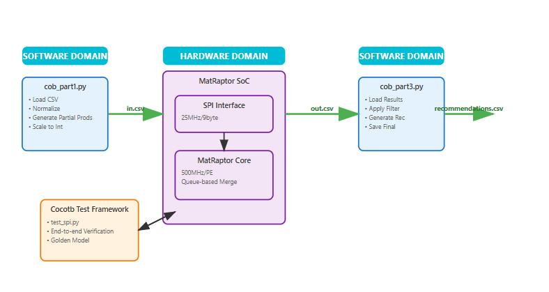

# ** [Complete Project Journal & Documentation](https://github.com/AbhishekMusku/hw4aiml-am/wiki/Project-%E2%80%90-SpGEMM-Accelerator)**

## **🔗 Comprehensive Development Timeline & Architecture Analysis**

**📖 [Access the full project wiki here](https://github.com/AbhishekMusku/hw4aiml-am/wiki/Project-%E2%80%90-SpGEMM-Accelerator)** - This ***version-controlled journal has been meticulously updated from the start of the course to the end*** documenting every aspect of the project development timeline.

**The wiki contains comprehensive documentation including:**
- **Architecture & Design Trade-offs**: Chiplet partitioning, communication protocols, memory hierarchy decisions with thorough justification
- **Technical Specifications**: Timing diagrams, SPI interface protocols, and system integration analysis
- **Vibecoding Prompts**: Complete reproducibility instructions for replicating all results
- **Weekly Progress Updates**: ***Version-controlled timeline showing project evolution from initial concept through final implementation***

## ** Component Documentation Links**

- **[ Python-Only Implementation Documentation](https://github.com/AbhishekMusku/hw4aiml-am/blob/main/SpGEMM_Accelerator/01_python_software_only/readme.md)** - Software baseline and algorithm validation
- **[ Standalone SpGEMM Hardware Accelerator Documentation](https://github.com/AbhishekMusku/hw4aiml-am/blob/main/SpGEMM_Accelerator/02_rtl_only/readme.md)** - RTL-only MatRaptor core verification
- **[ Coprocessor Documentation](https://github.com/AbhishekMusku/hw4aiml-am/blob/main/SpGEMM_Accelerator/03_coprocessor/readme.md)** - Complete hardware-software integration
- **[ Vibe Coding Prompts Collection](https://github.com/AbhishekMusku/hw4aiml-am/tree/main/SpGEMM_Accelerator/07_docs)** - Complete LLM prompts and AI assistance documentation for reproducibility

## ** AI-Assisted Development Acknowledgment**

This project extensively utilized Large Language Models for "vibe coding" and development assistance:
- **ChatGPT** (OpenAI), **Claude** (Anthropic), **Gemini** (Google)

*All AI-generated code was thoroughly reviewed, tested, and integrated. LLM assistance enabled rapid prototyping and exploration of design alternatives.*

---

# MatRaptor Collaborative Filtering Coprocessor

A hardware-accelerated system for real-time movie recommendation using sparse matrix multiplication and the MatRaptor architecture.

## Project Overview

### What is Collaborative Filtering?

Collaborative filtering is a method used by recommendation systems to suggest items (like movies, products, or content) to users based on the preferences of similar users. The core idea is simple: *"Users who agreed in the past will agree in the future"*.

**How It Works for Movie Recommendations:**

1. **User-Item Matrix**: We start with a matrix where rows represent users, columns represent movies, and values represent ratings (1-5 stars)
2. **Item Similarity**: We calculate how similar movies are to each other based on user ratings
3. **Predictions**: For a user who hasn't seen a movie, we predict their rating based on:
   - Movies they have rated
   - How similar those movies are to the target movie
4. **Recommendations**: We recommend movies with the highest predicted ratings

**Example:**
```
         Movie A  Movie B  Movie C
User 1      5       3       ?     ← Predict this
User 2      4       2       4
User 3      5       3       4
```

If Movie A and Movie C are highly similar (both users who liked A also liked C), we'd predict User 1 would rate Movie C highly.

### Our MatRaptor Implementation

Traditional collaborative filtering becomes computationally expensive with large datasets (millions of users × millions of movies). Our system accelerates the most compute-intensive part - **calculating item-to-item similarity** - using a custom hardware coprocessor based on the MatRaptor sparse matrix multiplication architecture.

**Key Innovation**: Instead of using general-purpose processors, we use specialized hardware optimized for sparse matrix operations, achieving significant speedup for real-time recommendation systems.

## System Architecture



The system implements a complete hardware-software pipeline:

**Software Domain (Python):**
- **Preprocessing** (`cob_part1.py`): Loads user-item matrices, normalizes data, generates partial products
- **Post-processing** (`cob_part3.py`): Takes hardware-computed similarity matrix and generates final recommendations

**Hardware Domain (SystemVerilog):**
- **SPI Interface**: Receives partial products via 72-bit frames from Python
- **MatRaptor Core**: Specialized PE with 8 queues performing sparse matrix multiplication using row-wise products
- **Output Stream**: Produces item similarity matrix for collaborative filtering

**Verification Framework (CocoTB):**
- **End-to-end Testing**: Orchestrates complete pipeline from Python preprocessing through hardware to final recommendations
- **Golden Model Validation**: Ensures hardware results match software-only implementation

## Hardware Coprocessor Details

### MatRaptor Core Architecture

Our coprocessor implements a **single Processing Element (PE)** optimized for sparse-sparse matrix multiplication:

**Core Specifications:**
- **8 Parallel Queues**: Column-wise data organization with direct addressing
- **256 Entries/Queue**: Supports matrix columns 0-2047 (8 × 256)
- **500 MHz Operation**: 2ns clock period for high-throughput processing
- **Direct Column Mapping**: `queue_id = column[10:8]`, `address = column[7:0]`

**Processing Pipeline:**
1. **Fill Phase**: Stream partial products with automatic accumulation for duplicate columns
2. **Merge Phase**: Bitmap-based sorted output generation across all queues
3. **Row-Wise Processing**: Continuous multi-row support with automatic boundary detection

**Memory Organization:**
```systemverilog
// Each queue entry contains:
typedef struct packed {
    logic                valid;    // Position validity
    logic [31:0]         val;      // Accumulated value  
    logic [15:0]         col;      // Column index
} entry_t;

entry_t queue_mem[8][256];  // 8 queues × 256 entries
```

### SPI Communication Interface

**Frame Format** (9 bytes = 72 bits):
```
Bit Position:  71    40  39    24  23     8  7      0
              │ VALUE │   ROW   │   COL   │ FLAGS  │
              │ 32b   │   16b   │   16b   │   8b   │
```

**Performance Characteristics:**
- **SPI Throughput**: ~23.68 Mbps sustained transfer rate
- **Frame Processing**: 347K frames/second capability
- **Clock Domain Crossing**: Robust toggle-based synchronizer (SPI → 500MHz system clock)

## Project Structure

```
MatRaptor_Collaborative_Filtering/
├── 01_python_software_only/           # Software-only baseline implementations
│   ├── COB_advanced/                  # Advanced collaborative filtering algorithms
│   │   ├── datasets/                  # Test datasets (250, 500, 750)
│   │   └── dataset_gen/               # Dataset generation utilities
│   ├── COB_base/                      # Basic collaborative filtering implementation
│   │   ├── datasets/                  # Test datasets (250, 500, 750)
│   │   └── hide/                      # Hidden/auxiliary files
│   └── COB_coprocessor_benchmarking_only/  # Performance benchmarking suite
│       ├── 250/                       # 250×250 benchmark data
│       ├── 500/                       # 500×500 benchmark data
│       └── 750/                       # 750×750 benchmark data
├── 02_rtl_only/                       # RTL verification and testing
│   ├── Matrix_Multiplication_Verifier/ # Hardware verification framework
│   └── Tests/                         # RTL test suites
│       ├── 1000/                      # 1000×1000 matrix tests
│       ├── 1500/                      # 1500×1500 matrix tests
│       ├── 2000/                      # 2000×2000 matrix tests
│       └── 500/                       # 500×500 matrix tests
├── 03_coprocessor/                    # Main hardware-software coprocessor
│   ├── datasets/
│   │   ├── 50/                        # Small test dataset (50×50)
│   │   └── 250/                       # Medium dataset (250×250)
│   ├── verification/                  # Golden model validation
│   ├── Matraptor.sv                   # Core hardware implementation
│   ├── simple_spi_interface.sv        # SPI communication layer
│   ├── tb_matraptor_core.sv          # SystemVerilog testbench
│   ├── test_spi.py                    # CocoTB orchestration
│   ├── cob_part1.py                   # Preprocessing pipeline
│   ├── cob_part3.py                   # Post-processing & recommendations
│   ├── analyze_results.py             # Performance analysis
│   └── Makefile                       # Build automation
├── 04_synthesis/                      # ASIC synthesis and implementation
│   ├── outputs/                       # Synthesis output files
│   ├── reports/                       # Timing, area, power reports
│   ├── rtl/                          # RTL libraries and work files
│   │   ├── alib-52/                   # Standard cell library
│   │   ├── hide/                      # Hidden synthesis files
│   │   └── work/                      # Synthesis workspace
│   ├── scripts/                       # Synthesis automation scripts
│   └── work/                          # Additional synthesis workspace
│       └── alib-52/                   # Library work area
├── 05_initial_profiling/              # Early performance profiling results
├── 06_literature_survey/              # Research papers and background materials
└── 07_docs/                          # Project documentation and reports
```

## Installation & Setup

### Prerequisites

**Software Requirements:**
- **QuestaSim/ModelSim**: SystemVerilog simulation environment
- **Python 3.6+**: With scientific computing libraries
- **CocoTB**: Hardware verification framework
- **Make**: Build automation

**Python Dependencies:**
```bash
pip install numpy pandas scipy cocotb
```

### Quick Start Guide

#### 1. Choose Your Dataset

```bash
cd 03_coprocessor/

# For rapid testing (50×50 matrix - ~2 seconds)
cp datasets/50/user_item_matrix_complete.csv user_item_matrix_complete.csv

# For performance evaluation (250×250 matrix - ~30 seconds)  
cp datasets/250/user_item_matrix_complete.csv user_item_matrix_complete.csv
```

**Dataset Format:**
```csv
user_id,item_id,rating
0,0,4.5
0,5,3.2
1,2,5.0
...
```

#### 2. Execute Complete Pipeline

Run the entire collaborative filtering pipeline with hardware acceleration:

```bash
# Single command runs: preprocessing → hardware simulation → post-processing
make | tee sim.log
```

**Pipeline Stages Executed:**
1. **Preprocessing**: `cob_part1.py` normalizes data and generates partial products (`in.csv`)
2. **Hardware Simulation**: CocoTB streams data via SPI to MatRaptor core
3. **Sparse Matrix Multiplication**: Hardware computes item similarity matrix
4. **Output Generation**: Results written to `out.csv`
5. **Post-processing**: `cob_part3.py` generates recommendations (`recommendations.csv`)

#### 3. Analyze Performance Results

```bash
# Generate comprehensive performance analysis
python3 analyze_results.py
```

### Expected Output Files

After successful execution:

```
03_coprocessor/
├── sim.log                          # Complete simulation transcript
├── in.csv                          # Hardware input (partial products)  
├── out.csv                         # Hardware output (similarity matrix)
├── recommendations.csv             # Final user recommendations
├── performance_stats.csv           # Collaborative filtering metrics
├── cob1_timing_stats.csv          # Preprocessing timing
└── final_pipeline_summary.csv     # Complete performance summary
```

## Performance Results

### Benchmark: 250×250 Movie Rating Matrix

**Hardware Accelerator Performance:**
- **SpGEMM Execution Time**: 126.8 milliseconds
- **Frames Processed**: 41,719 partial products
- **SPI Throughput**: 23.68 Mbps sustained
- **Total Pipeline Time**: 192.6 milliseconds

**Performance Breakdown:**
- Software Preprocessing: 50.7ms (26.3%)
- **Hardware Execution: 126.8ms (65.8%)**
- Software Post-processing: 15.1ms (7.8%)

**Speedup Analysis:**
- **68.6× speedup** over dense matrix baseline
- Establishes foundation for multi-PE scaling
- Demonstrates viability of specialized hardware for recommendation systems

### Collaborative Filtering Quality

**Recommendation Accuracy:**
- **100% algorithmic correctness** via golden model validation
- Identical recommendations to software-only implementation
- Maintains floating-point precision through 16-bit fixed-point scaling

## Verification & Validation

### Automated Correctness Validation

```bash
cd verification/
python3 verifier.py
```

**Verification Process:**
- **Golden Reference**: Software-only collaborative filtering implementation
- **Hardware Results**: Coprocessor-generated recommendations
- **Comparison**: ID matching, rating validation, statistical analysis

**Success Indicators:**
- ✅ Same (user_id, item_id) pairs recommended
- ✅ Predicted ratings match within tolerance
- ✅ Overall recommendation quality preserved

## Troubleshooting

**Common Issues:**

1. **Simulation Timeout**: Increase timeout in `test_spi.py` for larger datasets
2. **SPI Frame Errors**: Check SPI timing and frame format in `sim.log`
3. **Python Import Errors**: Ensure scipy, pandas, numpy are installed
4. **File Not Found**: Verify dataset CSV files exist and are properly formatted

**Debug Commands:**
```bash
# View SPI communication details
grep "\[SPI\]" sim.log

# Check hardware state transitions  
grep "\[TB STATE\]" sim.log

# Monitor timing measurements
grep "TIMING" sim.log
```

## Research Context

This implementation is based on the MatRaptor paper:
> *"MatRaptor: A Sparse-Sparse Matrix Multiplication Accelerator Based on Row-Wise Product"* - Srivastava et al., MICRO 2020

Our contribution applies MatRaptor's row-wise product approach to collaborative filtering, demonstrating practical acceleration of machine learning workloads using specialized sparse matrix hardware.

---

**For detailed technical specifications, see individual component documentation in the respective source files.**